# Basic CI/CD

Отчет по разработке простого **CI/CD** для проекта *SimpleBashUtils*. Сборка, тестирование, развертывание проходили в рамках другого репозитория на GitLab. В данном отчёте представлены скриншоты с результатами.

## Contents

1. [Chapter I](#chapter-i) \
   1.1. [Настройка gitlab-runner](#part-1-настройка-gitlab-runner)  
   1.2. [Сборка](#part-2-сборка)  
   1.3. [Тест кодстайла](#part-3-тест-кодстайла)   
   1.4. [Интеграционные тесты](#part-4-интеграционные-тесты)  
   1.5. [Этап деплоя](#part-5-этап-деплоя)  
   1.6. [Дополнительно. Уведомления](#part-6-дополнительно-уведомления)


## Chapter I

В качестве результата работы нужно будет сохранить два дампа образов виртуальных машин, описанных далее. \
**P.S. Ни в коем случае не сохраняй дампы в гит!**

### Part 1. Настройка **gitlab-runner**

**== Задание ==**

##### Подними виртуальную машину *Ubuntu Server 22.04 LTS*.
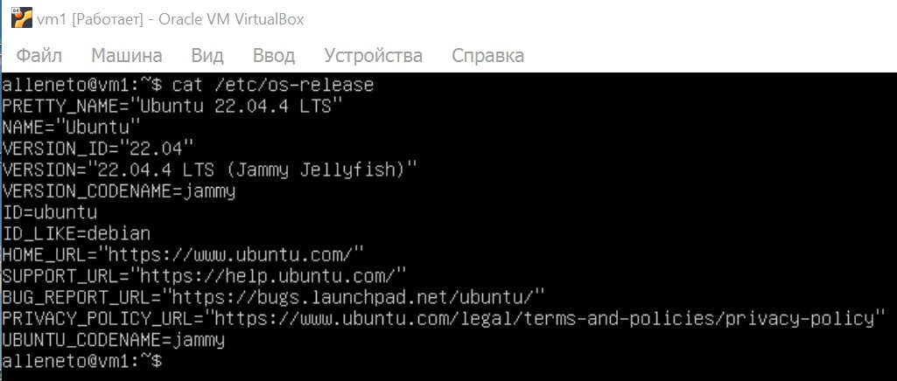

##### Скачай и установи на виртуальную машину **gitlab-runner**.
C помощью команды `curl -L "https://packages.gitlab.com/install/repositories/runner/gitlab-runner/script.deb.sh" -o gitlab-runner-install.sh` настраиваем репозиторий
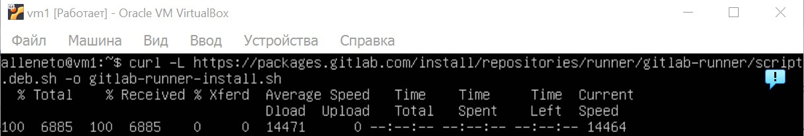

Далее устанавливаем gitlab-runner: `sudo apt-install gitlab-runner`
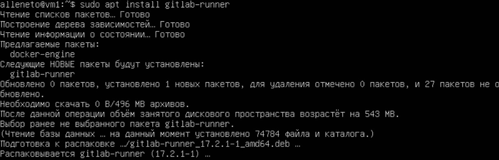
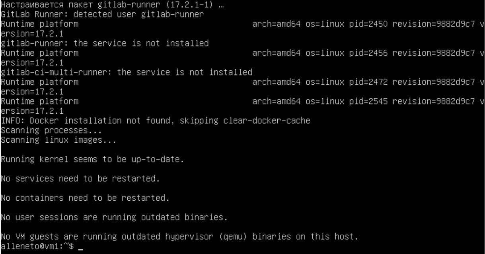

##### Запусти **gitlab-runner** и зарегистрируй его для использования в текущем проекте (*DO6_CICD*).
Для этого регистрируем свой гитлаб-раннер командой `sudo gitlab-runner register` 
Необходимые URL и Token находятся на платформе сбера под ссылкой на репозиторий.
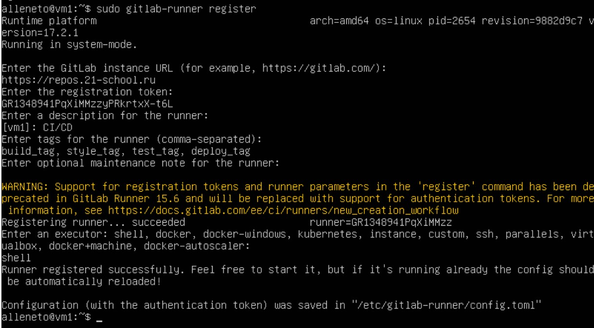

После проверим, что gitlab-runner работает успешно
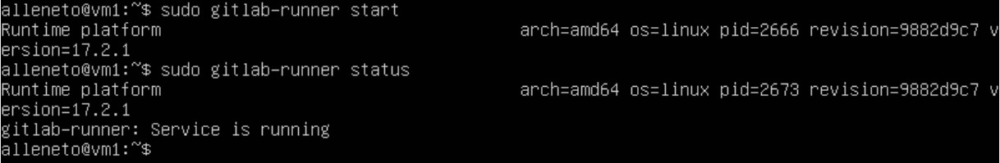

### Part 2. Сборка

Сохранила в свой репозиторий директории cat/ и grep/ из проекта *C2_SimpleBashUtils*
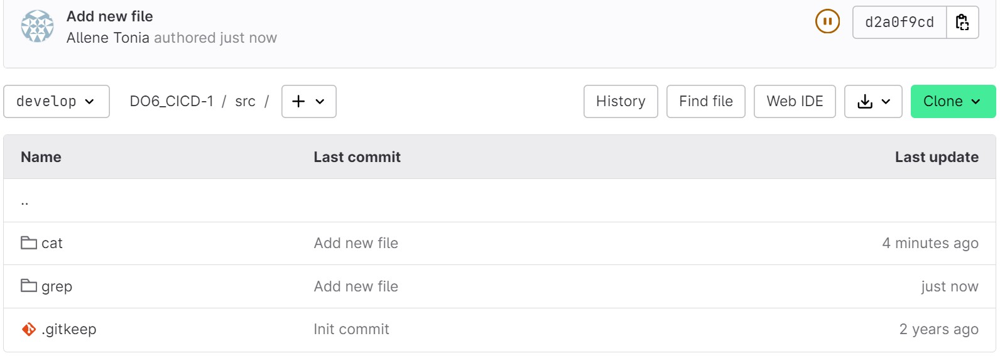

Также установила на ВМ vm1 необходимые программы для Makefile и gcc
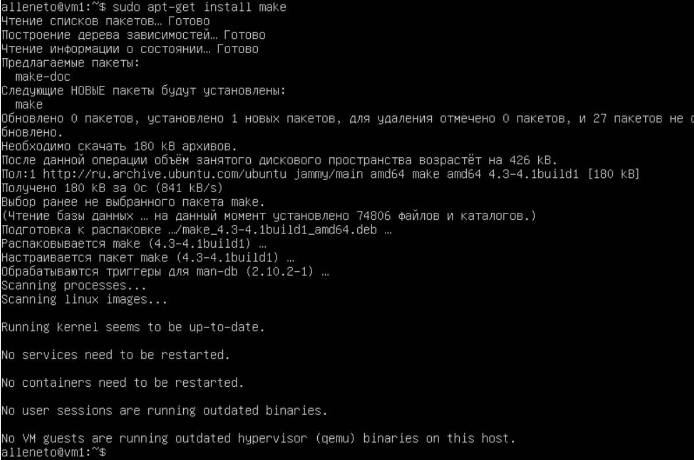
Makefile

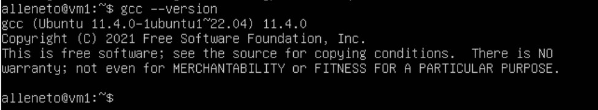
gcc

**== Задание ==**

#### Написала этап для **CI** по сборке приложений из проекта *C2_SimpleBashUtils*. В файле _gitlab-ci.yml_ добала этап запуска сборки через мейк файл из проекта _C2_. Файлы, полученные после сборки (артефакты), сохраняются в произвольную директорию со сроком хранения 30 дней.
```bash
default:
    tags: [build_tag]

stages:
    - build

job_build:
    stage: build
    tags:
        - build_tag
    script:
        - cd src/cat
        - make
        - cd ../grep
        - make
    artifacts:
        paths:
            - src/cat
            - src/grep
        expire_in: 30 days
```

После внесения изменений в файле .gitlab-ci.yml проверила pipelines
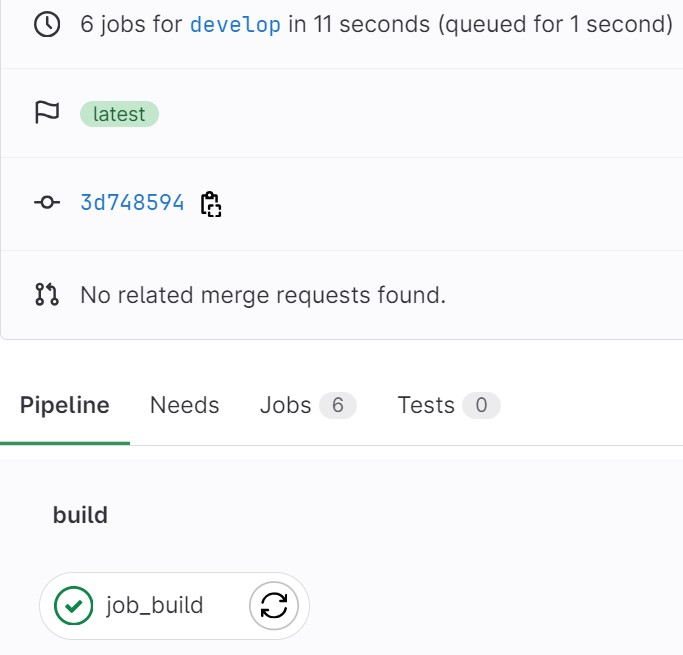

Cобранные артифакты доступны к скачиванию в произвольной директории
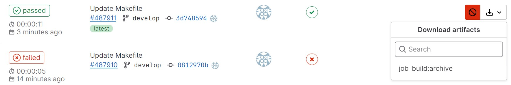

Проверяем, успешно ли отработал script


### Part 3. Тест кодстайла

**== Задание ==**

#### Напиши этап для **CI**, который запускает скрипт кодстайла (*clang-format*). Если кодстайл не прошел, то «зафейли» пайплайн. В пайплайне отобрази вывод утилиты *clang-format*.

Для этого установила clang-format на vm1
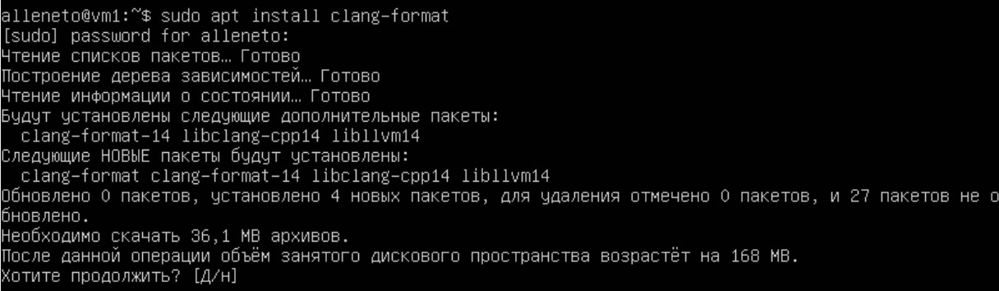

Дописала в скрипте stage *job-style*:

```bash
default:
    tags: [build_tag]

stages:
    - build
    - style

job_build:
    stage: build
    tags:
        - build_tag
    script:
        - cd src/cat
        - make
        - cd ../grep
        - make
    artifacts:
        paths:
            - src/cat
            - src/grep
        expire_in: 30 days

job_style:
    stage: style
    tags:
        - style_tag
    script:
        - cd src/cat
        - echo "Checking formatting for src/cat/*.c *.h"
        - clang-format -n -Werror *.c *.h
        - if [ $? -eq 0 ]; then echo "Checked successfully src/cat/*.c *.h"; else echo "Formatting errors found in src/cat/*.c *.h"; fi
        - cd ../grep
        - echo "Checking formatting for src/grep/*.c *.h"
        - clang-format -n -Werror *.c *.h
        - if [ $? -eq 0 ]; then echo "Checked successfully src/grep/*.c *.h"; else echo "Formatting errors found in src/grep/*.c *.h"; fi
```

Затем проверила pipelines:
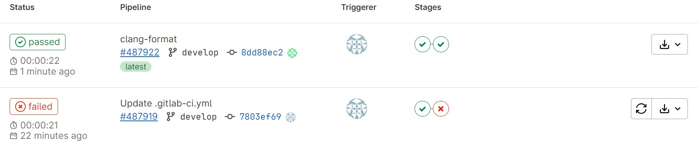

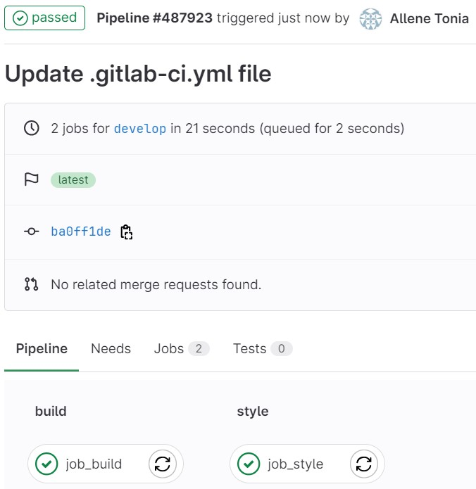

И результат отработки скрипта:
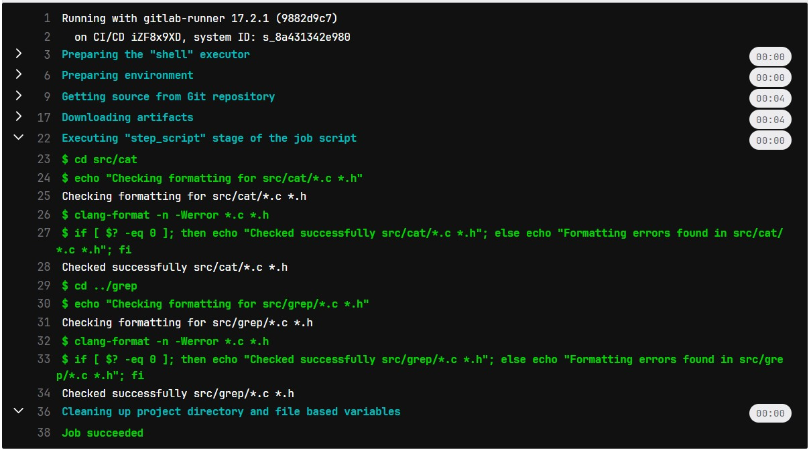

### Part 4. Интеграционные тесты

**== Задание ==**

#### Напиши этап для **CI**, который запускает твои интеграционные тесты из того же проекта. Запусти этот этап автоматически только при условии, если сборка и тест кодстайла прошли успешно. 

Прописываем стадию тестов, которая выполнится только при условии успешного выполнения предыдущих стадий:
```bash
default:
    tags: [build_tag]

stages:
    - build
    - style
    - test

job_build:
    stage: build
    tags:
        - build_tag
    script:
        - cd src/cat
        - make
        - cd ../grep
        - make
    artifacts:
        paths:
            - src/cat
            - src/grep
        expire_in: 30 days

job_style:
    stage: style
    tags:
        - style_tag
    script:
        - cd src/cat
        - echo "Checking formatting for src/cat/*.c *.h"
        - clang-format -n -Werror *.c *.h
        - if [ $? -eq 0 ]; then echo "Checked successfully src/cat/*.c *.h"; else echo "Formatting errors found in src/cat/*.c *.h"; fi
        - cd ../grep
        - echo "Checking formatting for src/grep/*.c *.h"
        - clang-format -n -Werror *.c *.h
        - if [ $? -eq 0 ]; then echo "Checked successfully src/grep/*.c *.h"; else echo "Formatting errors found in src/grep/*.c *.h"; fi

job_test:
    stage: test
    when: on_success
    tags:
        - test_tag
    script:
        - cd src/cat
        - make
        - echo "Beginning tests for cat"
        - make test
        - if [ $? -eq 0 ]; then echo "Tests for cat completed successfully"; else echo "Tests for cat failed"; fi
        - cd ../grep
        - make
        - echo "Beginning tests for grep"
        - make test
        - if [ $? -eq 0 ]; then echo "Tests for grep completed successfully"; else echo "Tests for grep failed"; fi
```

Проверила результат работы pipelines
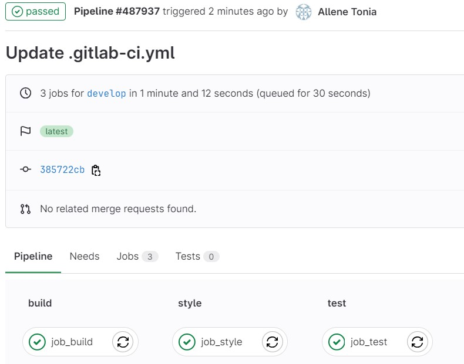

### Part 5. Этап деплоя

`-` Для завершения этого задания ты должен перенести исполняемые файлы на другую виртуальную машину, которая будет играть роль продакшна. Удачи.

**== Задание ==**

##### Подняла вторую виртуальную машину *Ubuntu Server 22.04 LTS*.
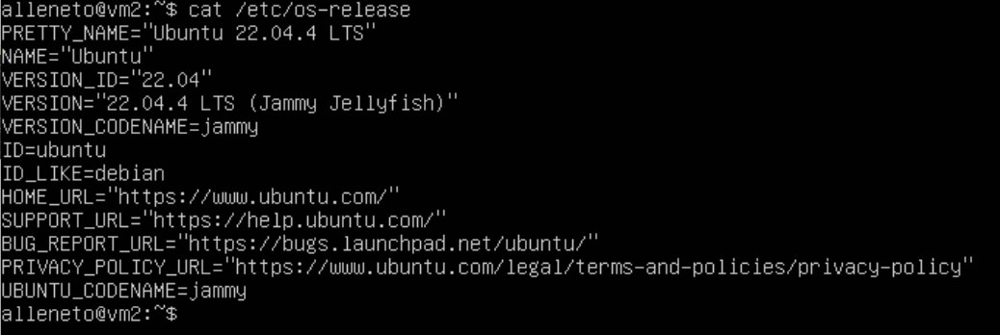

Настроила статическую маршрутизацию между машинами vm1 и vm2
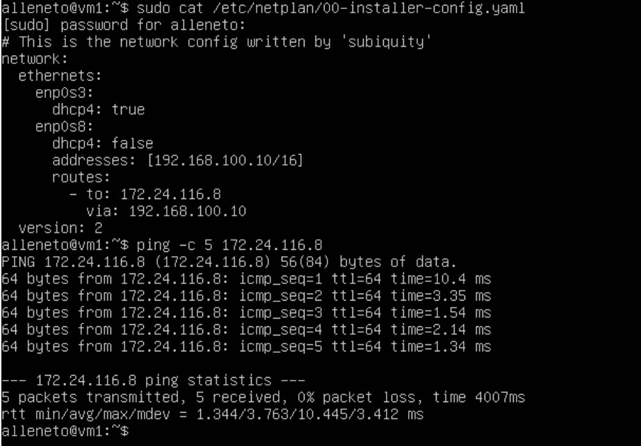
vm1

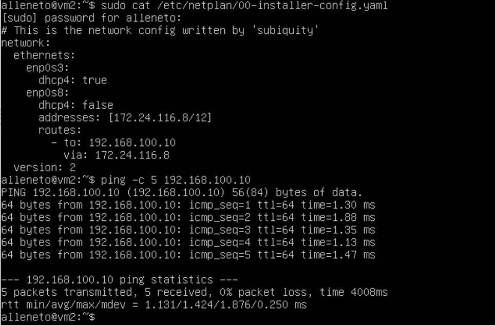
vm2

Для найстройки ssh установила на обе машины openssh-server
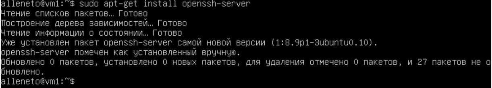
vm1

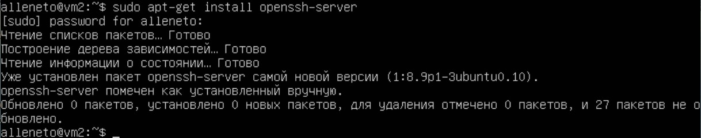
vm2

На vm1 сменила пользователя с помощью команды `sudo su gitlab-runner`
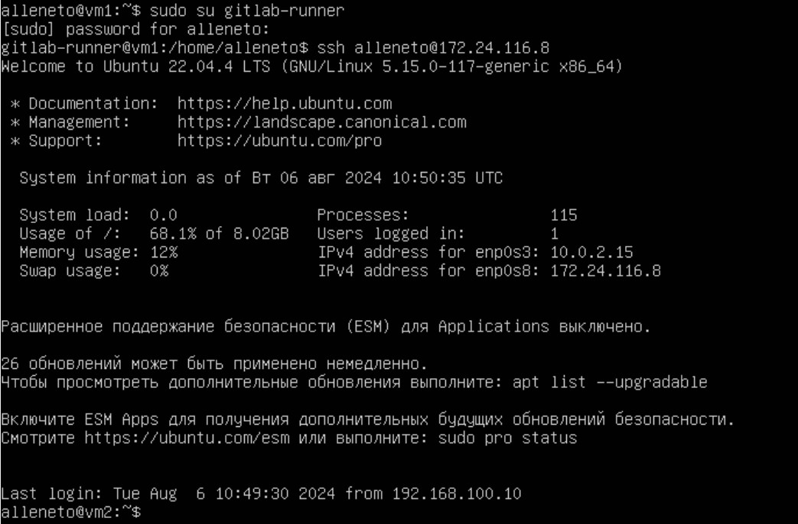

Затем сгенерировала ssh-keygen, скопировала его на vm2 и дала права на папку /usr/local/bin/


#### Написала этап для **CD**, который «разворачивает» проект на другой виртуальной машине.
```bash
default:
    tags: [build_tag]

stages:
    - build
    - style
    - test
    - deploy

job_build:
    stage: build
    tags:
        - build_tag
    script:
        - cd src/cat
        - make
        - cd ../grep
        - make
    artifacts:
        paths:
            - src/cat
            - src/grep
        expire_in: 30 days

job_style:
    stage: style
    tags:
        - style_tag
    script:
        - cd src/cat
        - echo "Checking formatting for src/cat/*.c *.h"
        - clang-format -n -Werror *.c *.h
        - if [ $? -eq 0 ]; then echo "Checked successfully src/cat/*.c *.h"; else echo "Formatting errors found in src/cat/*.c *.h"; fi
        - cd ../grep
        - echo "Checking formatting for src/grep/*.c *.h"
        - clang-format -n -Werror *.c *.h
        - if [ $? -eq 0 ]; then echo "Checked successfully src/grep/*.c *.h"; else echo "Formatting errors found in src/grep/*.c *.h"; fi

job_test:
    stage: test
    when: on_success
    tags:
        - test_tag
    script:
        - cd src/cat
        - make
        - echo "Beginning tests for cat"
        - make test
        - if [ $? -eq 0 ]; then echo "Tests for cat completed successfully"; else echo "Tests for cat failed"; fi
        - cd ../grep
        - make
        - echo "Beginning tests for grep"
        - make test
        - if [ $? -eq 0 ]; then echo "Tests for grep completed successfully"; else echo "Tests for grep failed"; fi

job_deploy:
    stage: deploy
    when: manual
    tags:
        - deploy_tag
    script:
        - bash ./src/script_for_deploy.sh
```

##### Написала bash-скрипт, который при помощи **ssh** и **scp** копирует файлы, полученные после сборки (артефакты), в директорию */usr/local/bin* второй виртуальной машины.
```bash
#!/bin/bash

HOST="172.24.116.8"
USER="alleneto"
TMP_DIR="/home/alleneto"
DEST_DIR="/usr/local/bin"

scp -r src/cat $USER@$HOST:$TMP_DIR
scp -r src/grep/ $USER@$HOST:$TMP_DIR

if [ $? -eq 0 ]; then
    echo "Artifacts copied to vm2"
else
    echo "Error: artifacts didn't copy to vm2"
    exit 1
fi

ssh $USER@$HOST "
				  rm -rf /usr/local/bin/cat; 
				  rm -rf /usr/local/bin/grep;
				  mv $TMP_DIR/cat $DEST_DIR; 
				  mv $TMP_DIR/grep $DEST_DIR
				" 


if [ $? -eq 0 ]; then
    echo "Files moved to folder bin successfully"
else
    echo "Error: files didn't move to folder bin"
    exit 1
fi
```
Проверила работу pipelines
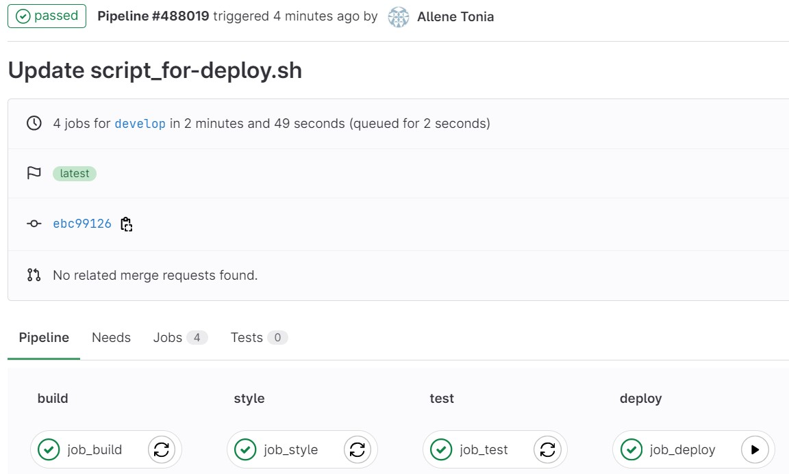

На второй машине vm2 появились готовые к работе приложения из проекта *SimpleBashUtils*
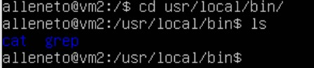

Результат работы скрипта
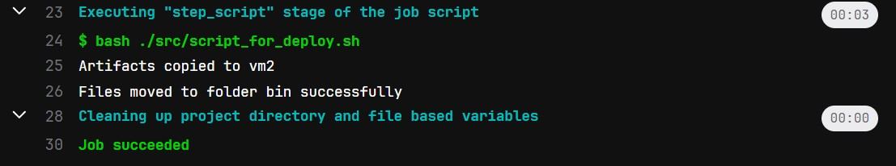

##### Сохранила дампы образов виртуальных машин.
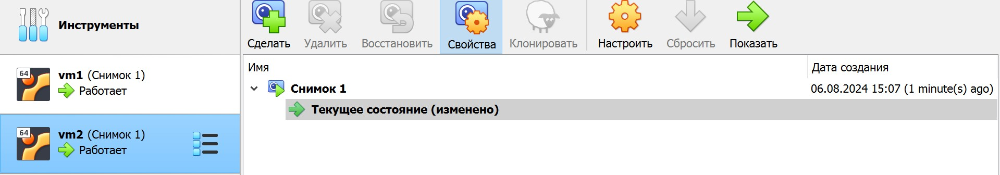

### Part 6. Дополнительно. Уведомления

**== Задание ==**

##### Настрой уведомления о успешном/неуспешном выполнении пайплайна через бота с именем «[твой nickname] DO6 CI/CD» в *Telegram*.

В telegram нашла бота @BotFather и создала бота «alleneto DO6 CI/CD»

Дописала скрипт из папки materials
```bash
TELEGRAM_BOT_TOKEN=7244418178:AAEN6YLos_hb_E_trzSWtn0iL2P79zkcfbc
TELEGRAM_USER_ID=321769981
TIME="10"
if [ "$CI_JOB_STATUS" == "success" ]; then
  MESSAGE="Done ✅"
else
  MESSAGE="Error 🚫"
fi
URL="https://api.telegram.org/bot$TELEGRAM_BOT_TOKEN/sendMessage"
TEXT="$1 %0AStatus: ${MESSAGE} %0A%0AProject:+$CI_PROJECT_NAME%0AURL:+$CI_PROJECT_URL/pipelines/$CI_PIPELINE_ID/%0ABranch:+$CI_COMMIT_REF_SLUG"

curl -s --max-time $TIME -d "chat_id=$TELEGRAM_USER_ID&disable_web_page_preview=1&text=$TEXT" $URL > /dev/null
```
Дописала скрипт в файле .gitlab-ci.yml
```bash
default:
    tags: [build_tag]

stages:
    - build
    - style
    - test
    - deploy

job_build:
    stage: build
    tags:
        - build_tag
    script:
        - cd src/cat
        - make
        - cd ../grep
        - make
    artifacts:
        paths:
            - src/cat
            - src/grep
        expire_in: 30 days
    after_script:
        - echo "Building..."
        - bash ./src/script_for_tg.sh "Build stage"

job_style:
    stage: style
    tags:
        - style_tag
    script:
        - cd src/cat
        - echo "Checking formatting for src/cat/*.c *.h"
        - clang-format -n -Werror *.c *.h
        - if [ $? -eq 0 ]; then echo "Checked successfully src/cat/*.c *.h"; else echo "Formatting errors found in src/cat/*.c *.h"; fi
        - cd ../grep
        - echo "Checking formatting for src/grep/*.c *.h"
        - clang-format -n -Werror *.c *.h
        - if [ $? -eq 0 ]; then echo "Checked successfully src/grep/*.c *.h"; else echo "Formatting errors found in src/grep/*.c *.h"; fi
    after_script:
        - echo "Style..."
        - bash ./src/script_for_tg.sh "Style stage"

job_test:
    stage: test
    when: on_success
    tags:
        - test_tag
    script:
        - cd src/cat
        - make
        - echo "Beginning tests for cat"
        - make test
        - if [ $? -eq 0 ]; then echo "Tests for cat completed successfully"; else echo "Tests for cat failed"; fi
        - cd ../grep
        - make
        - echo "Beginning tests for grep"
        - make test
        - if [ $? -eq 0 ]; then echo "Tests for grep completed successfully"; else echo "Tests for grep failed"; fi
    after_script:
        - echo "Testing..."
        - bash ./src/script_for_tg.sh "Test stage"

job_deploy:
    stage: deploy
    when: manual
    tags:
        - deploy_tag
    script:
        - bash ./src/script_for_deploy.sh
    after_script:
        - bash ./src/script_for_tg.sh CD
```
По итогу при выполнении деплоя приходят сообщения через бот с отчетом о результате
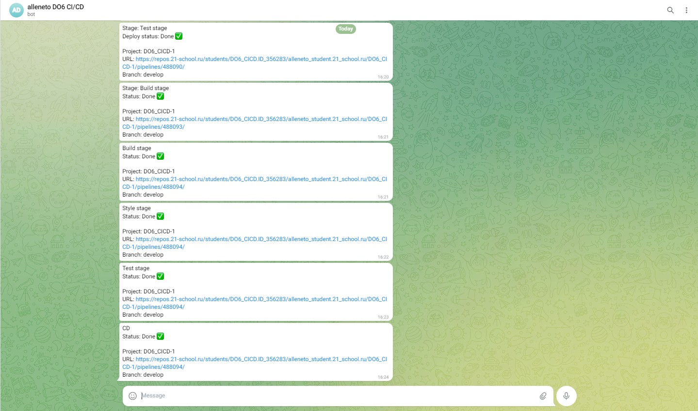

Результат работы скрипта
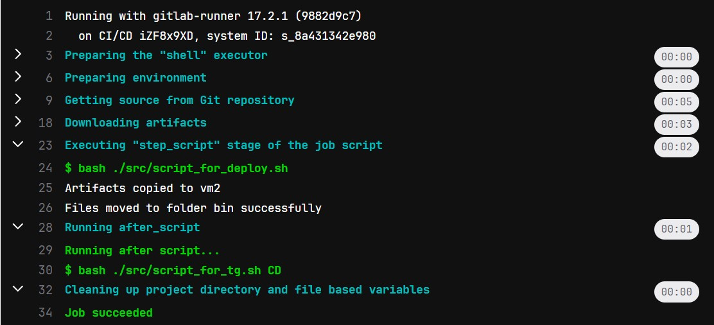
